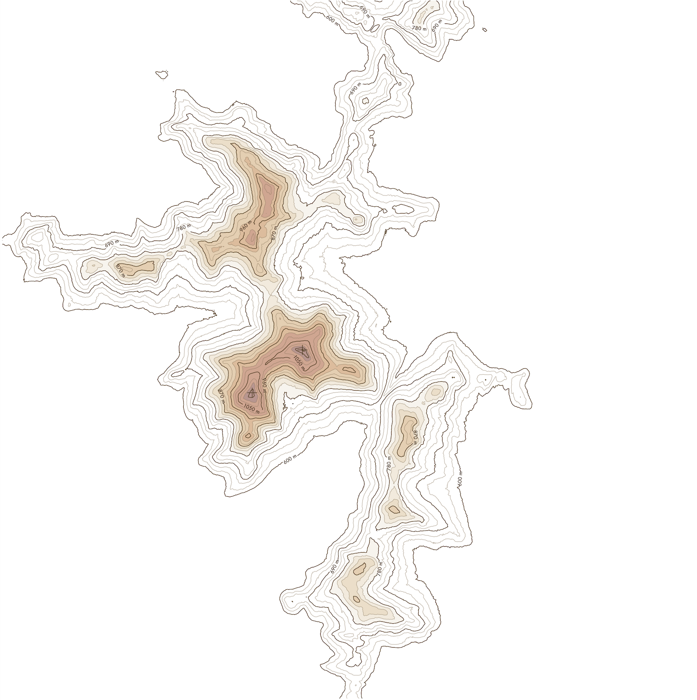
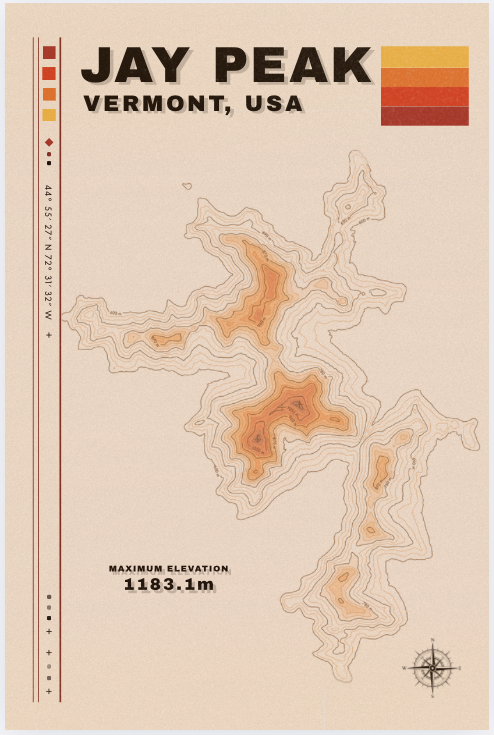

# Jay Peak Contour Art

Minimalist topographic contour maps of Jay Peak, Vermont, generated from high-resolution LiDAR data to produce a vintage poster aesthetic.

## Overview

This project processes elevation data from Vermont's LiDAR repository to produce publication-quality cartographic artwork. Output is suitable for a large-format poster printing (high-resolution PNG).

## Data Source

> LiDAR elevation data courtesy of the **[Vermont Center for Geographic Information (VCGI)](https://vcgi.vermont.gov/data-and-programs/lidar-program)**, available as USGS Quality Level-1 and Level-2 compliant Cloud Optimized GeoTIFFs via **[Vermont's Open Data S3 bucket on AWS](https://registry.opendata.aws/vt-opendata/)**. Data is freely available in the public domain.

## Features

- LiDAR source data at 35–70 cm resolution
- GPS coordinate-based peak extraction (44.9386°N, 72.5033°W)
- Intelligent downsampling with bilinear/max resampling to preserve summit accuracy
- Variable contour line (isoline) weights with master contours at regular intervals
- Customizable color schemes with selective highlighting for high elevations


## Requirements

```
python >= 3.12
matplotlib
rasterio
scipy
numpy
```

## Usage

1. Download LiDAR tiles for Jay Peak from Vermont's S3 open data bucket
2. Run the processing script to downsample and reproject the data
3. Generate contours with your desired color scheme and interval settings
4. Export to high-resolution PNG (300+ DPI) for print or web sharing

## Key Notes

- Use `bilinear` or `max` resampling — `average` resampling flattens summit features
- Large LiDAR files (>4 GB) require BIGTIFF format support in rasterio
- GPS-based peak extraction is more reliable than automated peak-finding algorithms for specific targets
- Check Y-axis orientation after coordinate transforms to avoid north-south inversions

## Output

High-resolution PNG at 300 DPI, sized for standard poster formats (e.g. 24×36 in). Suitable for both print and web sharing.


Final poster edited with tier software:


## License

Personal/educational use. LiDAR source data courtesy of the [Vermont Center for Geographic Information (VCGI)](https://vcgi.vermont.gov), available in the public domain.
